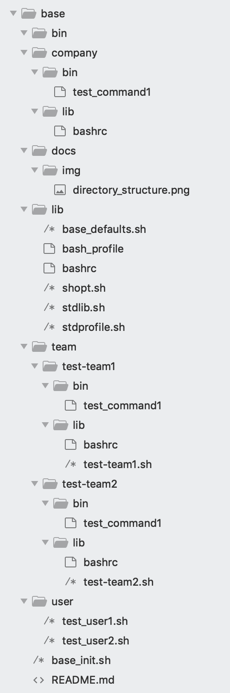

# **What is Base?**

Base is a sharing platform for shell settings, libraries, and light-weight tools. It gives a structured way for Bash users to organize the following across multiple hosts:

* .bash_profile
* .bashrc
* generic Bash libraries and commands
* company specific Bash libraries, commands, and configuration
* team specific Bash libraries, commands, and configuration
* user specific settings (aliases, functions, Bash settings)
* Bash libraries, commands, and configuration that are shared across teams

It can benefit anyone who engages with Mac/Linux command line to get things done.

# **How can I get set up?**

Set up is easy.  Essentially, this is what you have to do:

* Check out Base. The standard location for Base is $HOME/git/base.  In case your git directory is elsewhere, symlink `$HOME/git` to it or specify the path by setting `BASE_HOME` in `$HOME/.baserc` file.
* Consolidate your individual settings from your current `.bash_profile` and `.bashrc` into `$USER.sh` file.  Place this file under `base/user` directory and check it in to git.
* Make a backup of your `.bash_profile`.  Replace this file with a symlink to `base/lib/bash_profile`.
* Make a backup of your `.bashrc`.  Replace this file with a symlink to `base/lib/bashrc`.

Log out and log back in or just do `exec bash` and you are all set!

Here is an example:

    cd $HOME
    mkdir git && cd git
    git clone git@github.com:codeforester/base.git
    cd $HOME
    mv .bash_profile .bash_profile.safe && ln -sf $HOME/git/base/lib/bash_profile .bash_profile
    mv .bashrc       .bashrc.safe       && ln -sf $HOME/git/base/lib/bashrc       .bashrc
    cp $USER.sh $HOME/git/base/user
    cd $HOME/git/base
    git add user/$USER.sh
    git commit -m "Adding the initial version of $USER.sh"
    git push
    
# **How does Base work?**

In a typical setting, `.bashrc` sources in `$BASE_HOME/base_init.sh` which does the following:

* source in `lib/stdlib.sh`
* source in `company/lib/company.sh` if it exists
* source in `company/lib/bashrc` if it exists, if the shell is interactive
* source in `user/$USER.sh` if it exists and if the shell is interactive
* source in team specific bashrc from team/<team>/lib/bashrc for each team defined in BASE_TEAM and BASE_SHARED_TEAMS variables, if the shell is interactive
* source in team specific library from team/<team>/lib/<team.sh> for each team defined in BASE_TEAM and BASE_SHARED_TEAMS variables, if they exist
* update `$PATH` to include the relevant `bin` directories
    * `$BASE_HOME/bin` is always added
    * `$BASE_HOME/team/$BASE_TEAM/bin` is added if `$BASE_TEAM` is set in `user/$USER.sh`
    * `$BASE_HOME/team/$BASE_TEAM/bin` is added for each team defined in `$BASE_SHARED_TEAMS` (space-separated string), set in `user/$USER.sh`
    * `$BASE_HOME/company/bin` is always added

# **Directory structure**

# **Environment variables**

* BASE_HOME
* BASE_DEBUG
* BASE_TEAM
* BASE_SHARED_TEAMS
* BASE_OS
* BASE_HOST
* BASE_SOURCES

# **FAQ**

## My git location is not `$HOME/git/base`.  What should I do?

You can either

* specify your base location in `$HOME/.baserc`, like
      
  BASE_HOME=/path/to/base

* symlink `$HOME/git/base` to the right place

You need to do this on every host where you want base.

## I don't want to keep my personal settings private, and not in git.  What should I do?

* write a one-liner in `user/$USER.sh` like this:

    source /path/to/your.settings

## I do want to use the default settings.  What should I do?

Add this to your `user/$USER.sh` file:

    import lib/base_defaults.sh

## I want to make sure I keep my base repository updated always.  How can I do it?

Add this to your `user/$USER.sh` file:

    base_update

# **Debugging**

You can turn on debug mode by touching `$HOME/.base_debug` file.  You can also do the same by setting environment variable `BASE_DEBUG` to 1. You can add `set -x` to `$HOME/.baserc` file to trace the execution.
